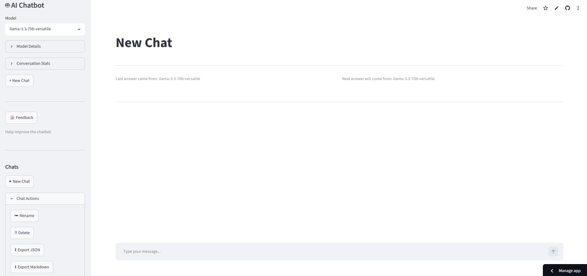

# Project 03 – Multi-Model AI Chatbot with Memory and Feedback System

## Live Demo

**Streamlit App:**  
https://chatbot-devesh.streamlit.app/

## Source Code

**GitHub Repository (Main Branch):**  
https://github.com/deveshusg/AI_Portfolio/tree/main/projects/03_streamlit_chatbot_deployed

**GitHub Permalink (Version Snapshot):**  
https://github.com/deveshusg/AI_Portfolio/tree/39edfdbfdf023f2e2bada12a7cc66732be5453f0/projects/03_streamlit_chatbot_deployed

---

## Project Overview

This project is a Streamlit-based AI chatbot that supports multiple Groq-hosted language models through a single interface.

The focus of the project is not only AI response generation, but also the surrounding systems required for a usable conversational application:

- Persistent conversations
- Conversation summarization
- Multi-model support
- Response streaming
- Conversation export
- Feedback collection
- Error handling
- Cloud deployment

---

## Application Screenshot

Screenshot captured from the deployed application.

---

## Features

### Conversation Management

- Create new conversations
- Store conversations locally as JSON files
- Rename conversations
- Delete conversations
- Export conversations as JSON
- Export conversations as Markdown

### AI Features

- Multiple model selection
- Streaming responses
- Response regeneration
- Conversation memory summarization
- Context reconstruction using summary + recent messages

### User Experience

- ChatGPT-style interface
- Sidebar conversation management
- Model information display
- Conversation statistics display
- Friendly error messages
- Technical error details for debugging

### Feedback Collection

- Feedback dialog
- Google Sheets integration
- Timestamped feedback records
- Chat context submission

---

## Supported Models

The application currently supports:

- groq/compound
- groq/compound-mini
- openai/gpt-oss-120b
- openai/gpt-oss-20b
- qwen/qwen3-32b
- meta-llama/llama-4-scout-17b-16e-instruct
- llama-3.3-70b-versatile

Model availability and quotas are managed by Groq.

---

## Technology Stack

| Technology | Purpose |
|------------|----------|
| Python | Application logic |
| Streamlit | User interface |
| Groq API | Model inference |
| JSON | Conversation storage |
| Google Sheets | Feedback storage |
| gspread | Google Sheets integration |
| google-auth | Google authentication |
| python-dotenv | Environment configuration |

---

## High-Level Architecture

User
 
 ↓

Streamlit UI

 ↓

app.py

 ↓

llm.py

 ↓

Groq API

 ↓

Selected Model

---

## Project Structure

03_streamlit_chatbot_deployed/

├── app.py

├── requirements.txt

├── README.md

│

├── src/

│   ├── config.py

│   ├── llm.py

│   ├── memory.py

│   ├── feedback.py

│   ├── model_manager.py

│   └── prompts.py

│

├── data/

│   ├── conversations/

│   └── exports/

│

└── .streamlit/

    └── secrets.toml

---

## Memory System

The chatbot stores conversations as JSON files.

Each conversation contains:

- Metadata
- Selected model
- Message history
- Conversation summary
- Timestamps

For larger conversations the application uses:

Summary
 +
Recent Messages

instead of sending the entire conversation history to the model.

This reduces prompt size and token consumption.

---

## Feedback Architecture

User
 ↓
Feedback Form
 ↓
feedback.py
 ↓
Google Service Account
 ↓
Google Sheets

Stored feedback includes:

- Timestamp
- Name
- Email
- Feedback text
- Chat ID
- Chat context

---

## Conversation Storage

Conversations are stored in:

data/conversations/

Exports are stored in:

data/exports/

### Note

Current persistence uses local JSON files.

This works well during local execution.

For long-term persistence in production environments, an external database or storage layer would eventually be more appropriate.

---

## Installation

### Clone Repository

git clone https://github.com/deveshusg/AI_Portfolio.git
cd AI_Portfolio/projects/03_streamlit_chatbot_deployed

### Create Virtual Environment

python -m venv .venv

### Activate Environment

Windows:

.venv\Scripts\activate

Linux / macOS:

source .venv/bin/activate

### Install Dependencies

pip install -r requirements.txt

### Configure Environment

Create a `.env` file:

GROQ_API_KEY=your_api_key
TEMPERATURE=0.7
MAX_TOKENS=1000
MAX_HISTORY_MESSAGES=10
SUMMARY_TRIGGER_MESSAGES=20

### Run Application

streamlit run app.py

---

## Skills Demonstrated

This project demonstrates:

- Python development
- Streamlit application development
- API integration
- State management
- JSON persistence
- Memory summarization workflows
- Prompt/context management
- Error handling
- Authentication
- Google Sheets integration
- Modular software architecture
- Cloud deployment

---

## Current Status

Completed:

- Multi-model chatbot
- Persistent conversations
- Memory summarization
- Streaming responses
- Response regeneration
- Feedback collection
- Google Sheets integration
- JSON export
- Markdown export
- Streamlit deployment

Potential Future Enhancements:

- PDF chat
- Embeddings
- Vector search
- Retrieval-Augmented Generation (RAG)
- Multi-document chat
- Agent workflows

---

## License

This project is part of the AI Portfolio repository and is intended for learning, experimentation, and portfolio demonstration purposes.
